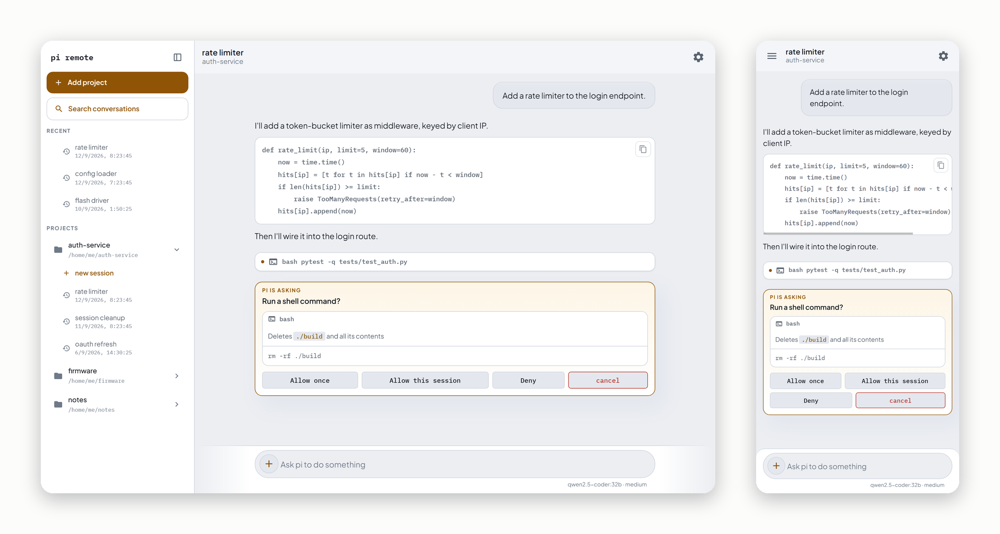
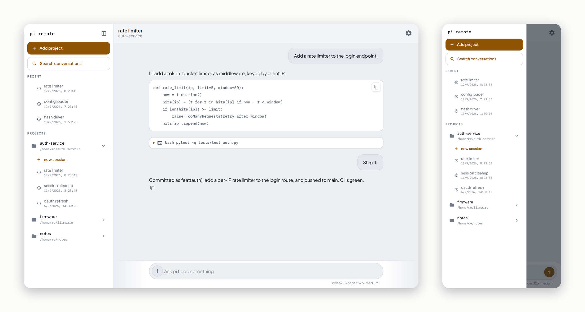
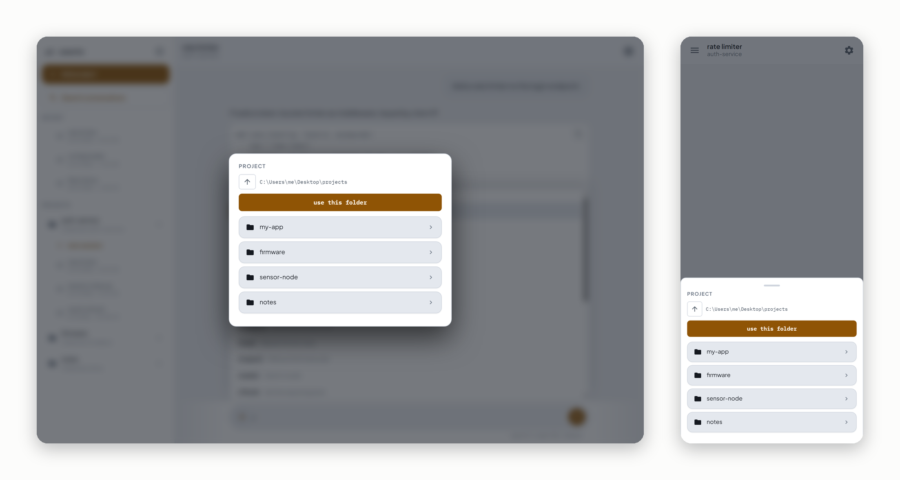
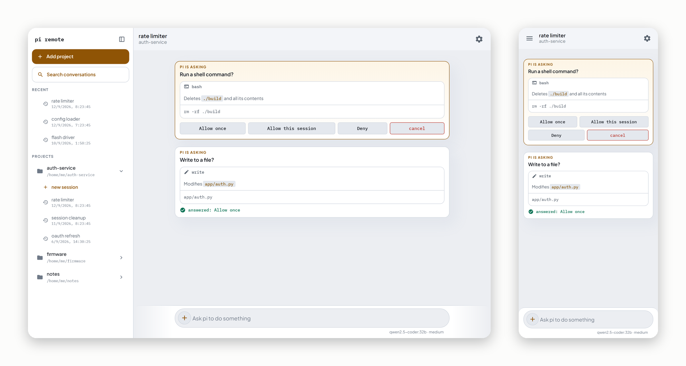
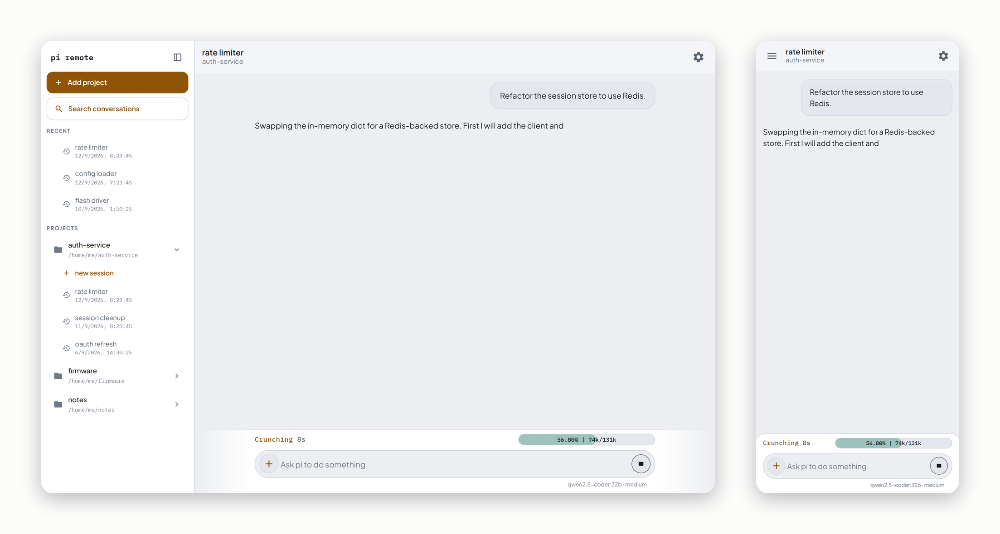
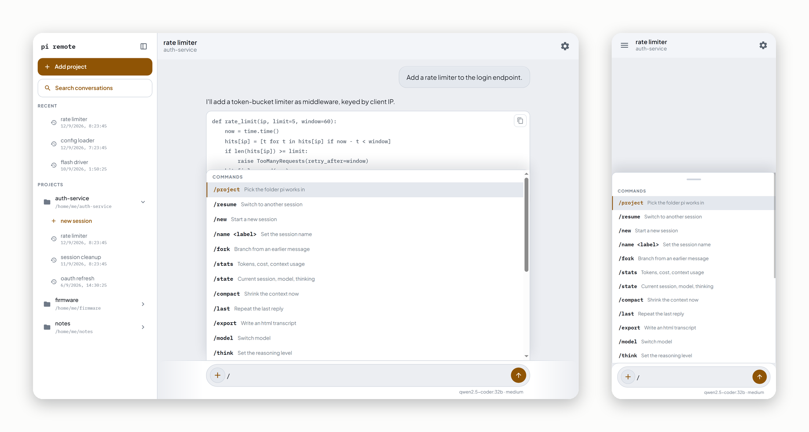
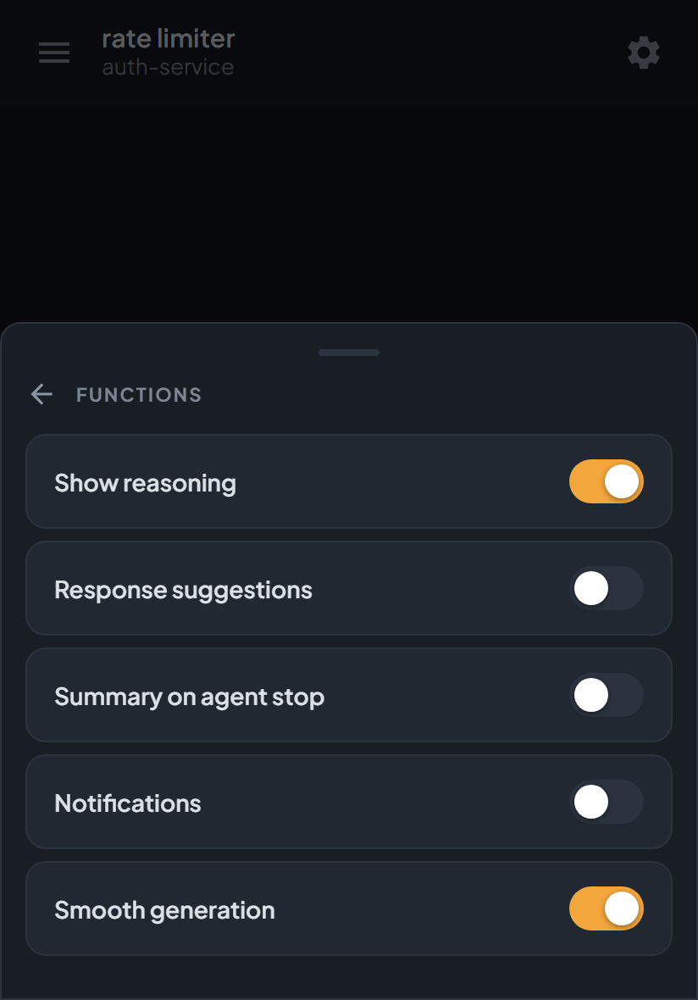

<p align="center">
  
</p>

Drive the [pi coding agent](https://pi.dev) from your phone, on **native
Windows**, with nothing in between. One Python process wraps `pi --mode rpc`
and serves a web app over your tailnet. No daemon, no Unix socket, no relay,
no third party: your browser talks to your own machine.

<p align="center">
  
</p>

> **Whoever holds the token can run commands on your machine.** There is no
> sandbox: the bridge starts a real agent in a real folder. A token is always
> required — one is generated at startup if you do not set `PI_WEB_TOKEN` —
> and the URL to open is printed with it. Only expose the port inside your
> tailnet. Read [Security](#security) before leaving it running.

## Why this exists

The agent has to run where the code is. If your code lives on Windows, the
existing options do not fit:

| | runs on native Windows | transcript stays home |
|---|---|---|
| [pi-web](https://github.com/jmfederico/pi-web) | no, WSL only | yes |
| [remote-pi](https://github.com/jacobaraujo7/remote_pi) | needs a relay | self-hosted relay |
| [pi-remote-control](https://github.com/CleverCloud/pi-remote-control) | via a hosted relay | no |
| Telegram bridges | yes | no |
| **this** | **yes** | **yes** |

The ones that keep everything at home assume a daemon plus a Unix domain
socket, which is exactly what Windows does not have.

## Install

```bash
pip install -r requirements.txt
cd C:\path\to\your\project
python pi_web_bridge.py
```

Open `http://<your-machine>:8770`. Over Tailscale, use the tailnet name.
Keep the `static/` folder next to the script: it holds the page, the icons and
the fonts, all served locally so the page never calls out to anyone.

| Variable | Default | Meaning |
|---|---|---|
| `PI_CMD` | auto-detected | path to the pi executable |
| `PI_RESUME` | `new` | `continue` picks up the latest session here |
| `PI_SESSION` | `web` | session name for a fresh session |
| `PI_WEB_HOST` | `0.0.0.0` | bind address |
| `PI_WEB_PORT` | `8770` | port |
| `PI_WEB_TOKEN` | generated | shared secret, appended as `?token=`. `off` drops the bridge to read only |
| `PI_WEB_ORIGINS` | none | extra allowed `Origin`s, comma separated |
| `PI_WEB_CWD` | none | project to open at startup |
| `PI_WEB_STATE` | `state.json` | where recent projects are kept |
| `PI_WEB_LOG` | `bridge.log` | log file when there is no console |

### Generating a token

Any long, random, hard-to-guess string works — treat it like a password:
whoever has it can run commands on your machine. Leave `PI_WEB_TOKEN` unset and
the bridge mints a temporary one for that run and prints it with the URL; set it
to keep the same token across restarts.

Python is already a dependency, so the portable one-liner works on every OS:

```bash
python -c "import secrets; print(secrets.token_urlsafe(32))"
```

Native, if you prefer:

| OS | Generate a token | Set it for the session |
|---|---|---|
| Windows · PowerShell | `$b=[byte[]]::new(24);[Security.Cryptography.RandomNumberGenerator]::Create().GetBytes($b);[Convert]::ToBase64String($b)` | `$env:PI_WEB_TOKEN="<token>"` |
| Windows · cmd | *(use the Python line above)* | `set PI_WEB_TOKEN=<token>` |
| Linux / macOS | `openssl rand -base64 32` | `export PI_WEB_TOKEN=<token>` |

To make it permanent, set it wherever you make the bridge start on its own —
the startup shortcut, the systemd unit, the launchd plist (see below).

## Install it as an app

The client is a PWA: over HTTPS it installs to the home screen, opens
full-screen with its own icon, and starts instantly from a cached shell.
It is still the same single page.

On Android it runs true full-screen (`display: fullscreen`), so even the
system status bar is hidden — swipe down to see the clock or notifications.
iOS does not support that and falls back to `standalone`, keeping its status
bar. Changing the display mode needs a reinstall of the app.

- **You need HTTPS.** A PWA will not install over plain HTTP, and on the
  phone the bridge is reached by its Tailscale name, not `localhost`, so it
  is not a secure context on its own. The clean route is `tailscale serve`,
  which puts an HTTPS reverse proxy in front of the bridge using your
  tailnet's own certificate — no open ports, no public exposure:

  ```
  tailscale serve --bg 8770
  ```

  Then open `https://<machine>.<tailnet>.ts.net/` and install from the
  browser menu. Set `PI_WEB_ORIGINS` to that origin (see [Security](#security)).

- **The installed app remembers the token.** It launches without the
  `?token=` query, so the first visit with a token stores it; later launches
  read it back. Clear it by clearing the site's data.

- The service worker caches only the shell (page, fonts, icons) so it opens
  offline as a shell; it never caches your data. Its cache name carries the
  version, so a bump refreshes everything on next load.

## Leave it running

The bridge is a server, not a terminal app, so it does not need a console at
all. The goal is not to recover it after closing the terminal: it is to never
be a child of one. Nothing extra to install — every option below is a feature
of the operating system.

### Windows

Three ways, least invasive first.

**1. Startup folder — start here.** Press `Win`+`R`, type `shell:startup`, and
drop a shortcut in it:

```
Target:      C:\Path\To\pythonw.exe  C:\Path\To\pi_web_bridge.py
Start in:    C:\Path\To\pi-remote
```

`pythonw.exe` is Python without a console, so there is no window and no
terminal to close; the log goes to `bridge.log`. It starts with your session
and keeps running. Two minutes, nothing registered, nothing to undo but
deleting the shortcut.

**2. Task Scheduler — if you want it to come back after a crash.** The startup
folder starts the bridge; it does not restart it. A task does. The cost is
that Task Scheduler was built for short maintenance jobs, not for long-lived
servers, and its defaults reflect that. Four settings decide whether this
survives:

| Setting | Why |
|---|---|
| `ExecutionTimeLimit` = `PT0S` | **Tasks stop after 72 hours by default.** Without this the bridge dies after three days with no clue why |
| Uncheck both battery options | Otherwise a laptop kills the bridge the moment you unplug it |
| *Only when the user is logged on* | The other choice runs in session 0, cut off from your desktop |
| A 30 s delay, and *restart if the task fails* | So Tailscale is up first, and a crash is not the end |

Trigger *at log on*, action `pythonw.exe` with the script, *start in* the
project folder. The four settings above are only reachable from the task's
properties or from an XML definition — the quick `schtasks` one-liner cannot
set them.

**3. A real Windows service.** Possible with NSSM or `pywin32`, and not
recommended here: both add an external dependency to a project whose whole
point is that it has almost none. The first two options already give you
everything a service would.

### Linux — systemd user service

`~/.config/systemd/user/pi-remote.service`:

```ini
[Unit]
Description=pi-remote bridge

[Service]
ExecStart=/usr/bin/python3 %h/pi-remote/pi_web_bridge.py
WorkingDirectory=%h/pi-remote
Restart=always
Environment=PI_WEB_TOKEN=...

[Install]
WantedBy=default.target
```

```bash
systemctl --user enable --now pi-remote
loginctl enable-linger $USER      # survives logging out
```

No traps here: `Restart=always` does what it says and there is no time limit.

### macOS — launchd

A plist in `~/Library/LaunchAgents/dev.pi-remote.plist` with `RunAtLoad` and
`KeepAlive` set to `true`, `ProgramArguments` pointing at python3 and the
script, then `launchctl load ~/Library/LaunchAgents/dev.pi-remote.plist`.
Same behaviour as systemd: starts on login, comes back if it dies.

### By hand

`pythonw pi_web_bridge.py` on Windows, `nohup python3 pi_web_bridge.py &`
elsewhere. Survives closing the terminal, but not a reboot.

### Whichever you choose

The machine has to stay awake. A laptop that suspends takes the bridge with
it, and no amount of configuration fixes that — check your power plan.

> Running unattended means nobody reads the console. That is why a missing
> token is also announced **on the page itself**, in a red strip under the
> header — once per browser, so it warns without becoming wallpaper. The
> current state is always in *about*.

## Projects and sessions

The bridge starts with no project. Pick a folder and it launches pi there;
the choice is remembered, so after a restart it comes back where you left off.
The last open session comes back too: on startup the bridge reopens that
exact session file, as long as it still exists in the project's session
folder — a trashed or moved one falls back to a fresh session.

<p align="center">
  
</p>

Under the two buttons, the **recents** section lists the four most recently
used sessions across all known projects, by last modification — tapping one
opens exactly that session. Below, the **projects** section keeps the
folders, in the order they were added.

**Search conversations** (magnifier button under *add project*) opens a full
screen with a search box: empty it lists every session of the known
projects, and any text filters by session name as you type. The X clears the
text — or closes the view when the text is already empty.

- **Tap a project** to unfold its sessions. Tap a session to open exactly that
  one; tap *new session* to start a fresh one in that folder.
- **Hold a project or a session** for a dialog with its actions.
- Removing a session does not delete it: pi has no delete over RPC, so the
  `.jsonl` is moved to a `_trash` folder beside it. The open session is
  refused.

<p align="center">
  
</p>

Opening a project rebuilds the transcript from pi's own `get_messages`, so the
history is the real session on disk, not something kept in memory.

## Permission dialogs

This is the part worth understanding, because it is where a remote agent
becomes safe to use.

pi ships **no permission prompts of its own**. Without a guardrails extension
installed, the agent runs whatever it decides to run. With one, the extension
asks, and that question arrives here as an `extension_ui_request` that
**blocks the turn until you answer** — indefinitely, since `pi-guardrails`
sets no timeout.

<p align="center">
  
</p>

Four things that are easy to get wrong, and that this bridge handles:

- **A permission is not yes or no.** A `select` dialog carries the extension's
  real options — allow once, allow for the session, deny — and they are shown
  as they come, never invented.
- **It says what the command will do, in plain words.** A `select` dialog only
  carries a title and the options: never the command. So the bridge pairs it
  with the tool call left running, and the page reads that command and says it
  in one line — `rm -rf ./build` becomes *deletes ./build and all its
  contents*. It is a lookup table, not a model: it never calls out, never
  guesses, and what it does not recognise it simply names.
- **While pi waits for you it is not working.** The readout bar disappears and
  leaves the screen to the approval card, so a blocked turn never looks like a
  busy one.
- **`notify` and `setStatus` need no answer** and are shown as plain notes.

The four dialog kinds — `select`, `confirm`, `input`, `editor` — are all
answered from the browser.

### Which guardrails work

pi has no prompts of its own, so the safety net is a guardrails extension — and
over RPC only the ones that ask through the standard dialog methods (`select`,
`confirm`, `input`, `editor`) reach you here. An extension that draws its UI
with `ctx.ui.custom()` gets nothing: that call returns `undefined` at once, and
the bridge can neither see nor answer it.

**Recommended: `pi-guardrails`.** Its command gate uses `select`, so dangerous
commands surface as a real dialog you can answer from the phone.

> ⚠️ **You have to change one of its settings, or file access breaks.**
> `pi-guardrails`' file-access guard (`pathAccess`, mode `ask`) — the prompt for
> touching a file **outside** the working directory — is drawn with
> `ctx.ui.custom()`, which does not exist over RPC. The call returns `undefined`,
> the bridge never sees a dialog, and that `undefined` is read as *deny*: every
> access outside the working directory is refused **silently**, with no prompt
> and no way to allow it (the agent just reports "User denied access outside
> working directory"). The command gate is fine — it uses `select` — so turn off
> only that one feature in `~/.pi/agent/extensions/guardrails.json`:
>
> ```json
> { "features": { "pathAccess": false } }
> ```
>
> (`"pathAccess": { "mode": "allow" }` works too.) The bridge cannot rescue this:
> the prompt never crosses into RPC.

<p align="center">
  
</p>

## Commands

Type `/`, or tap the **+** inside the composer and pick **Commands**.
Twenty-three commands, filtered as you type, with keyboard navigation on a
desktop browser. The same **+** menu attaches an image — paste one, or pick it
from the device — for a model that can see; it rides along with your next
message.

<p align="center">
  
</p>

The ones that cannot be undone — `/compact`, `/clearq`, `/new` — ask first.
`/bash` runs a command **skipping the model entirely**, and with it the
guardrails: it is your hand, not the agent's.

`/restart` asks too: it restarts the bridge itself, agent included. The kill
cannot come from inside — a child dies with its parent's tree — so the command
fires a one-shot scheduled task (the bridge registers it at startup), which
runs under the Task Scheduler service, outside the process tree. It waits a
20 s grace so the last reply lands intact, kills the bridge, relaunches it and
verifies the port answers. The session comes back from disk and the phone
reconnects on its own. On Windows, `pi_restart.py --ensure` is the idempotent
twin: point a startup shortcut at it instead of the bridge directly, and a
crash left over from last night costs nothing at log on.

## Functions

A **Functions** page in the settings menu holds five switches, each remembered
per browser:

- **Show reasoning** — the agent's thinking as a collapsible "Thought for N
  seconds" block, closed by default.
- **Response suggestions** — after each turn the model offers three likely
  replies as plain lines under its answer; a tap sends one. It appends a hidden
  instruction to every prompt, at a small context cost.
- **Summary on agent stop** — stopping a working turn asks the agent, in the
  background, for one line on what it was doing instead of just killing it.
- **Notifications** — a local notification, with the last reply as its body,
  when a turn ends while the tab is hidden. The browser's own; no third parties.
- **Smooth generation** — streamed text fades in left to right; turned off, it
  lands all at once.

<p align="center">
  
</p>

## Security

- **A bridge that runs things always has a token.** If you do not set
  `PI_WEB_TOKEN`, one is generated for that run and the full URL is printed
  at startup. There is no configuration in which reaching the port is enough
  to execute something.
- `PI_WEB_TOKEN=off` is the way to say you mean it: the bridge then answers
  only the read-only commands and refuses everything that acts — prompts,
  shell, opening projects. The page greys those out, but the refusal is in
  the server: a disabled button stops nobody who opens a WebSocket by hand.
- The WebSocket checks `Origin`, because WebSockets ignore the same-origin
  policy: any page you visit could otherwise open one against your tailnet.
  Behind a proxy such as `tailscale serve` the origin no longer matches the
  host, so set `PI_WEB_ORIGINS`.
- The page ships a strict CSP, `nosniff` and `no-referrer`, and the token is
  compared in constant time.
- pi ships no permission prompts of its own. Install a guardrails extension.
- The manifest, the service worker and the icons are the shell, not data, so
  they are served without a token; everything that acts still needs one.

## How it works

```
browser  <--WebSocket-->  pi_web_bridge.py  <--stdin/stdout JSONL-->  pi --mode rpc
```

The script spawns `pi --mode rpc` and owns its stdin and stdout. Events
(`agent_start`, `message_update`, `tool_execution_*`, `agent_settled`) become
messages to you; what you send becomes `prompt`, `steer` or `abort` commands.
A `prompt` or `steer` can carry attached images for a model with vision.

It cannot attach to a pi already running in a terminal: a process has one
stdin. What is shared is the session file on disk, so a session started in the
terminal can be opened here and the other way round. One writer at a time.

## Testing without a model

`tests/fake_pi.py` speaks enough of the RPC protocol to exercise everything:
streaming, tool calls, a permission dialog that blocks until answered, and
`get_messages` for history. No API key and no model needed.

```bash
python tests/run.py            # everything, about four minutes
python tests/run.py rail       # just the ones matching "rail"
```

Forty-three probes: the page is driven in a real headless Chrome through the
DevTools protocol, which is how the animation, contrast, layout and security
checks are measured rather than assumed. Chrome or Edge is found
automatically; point `CHROME` at it otherwise.

## License

MIT. See [LICENSE](LICENSE).

Third-party components: FastAPI (MIT), Uvicorn and Starlette (BSD-3-Clause),
Material Icons (Apache-2.0), IBM Plex Mono and Plus Jakarta Sans (OFL-1.1).
